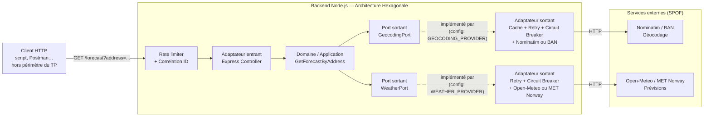
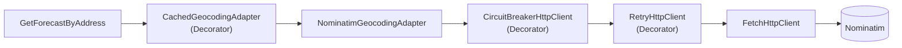
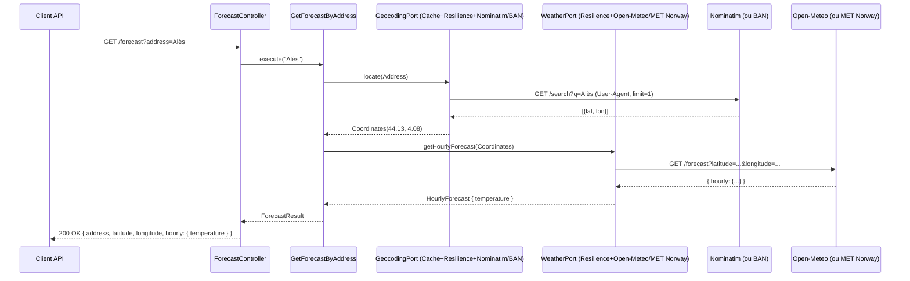

# Spécifications Techniques Détaillées (STD)
## TP1/TP2 — API Météo par adresse, multi-fournisseurs

| | |
|---|---|
| **Projet** | TP1/TP2 - Gestion des dépendances, risques et maintenabilité |
| **Version** | 2.0 — étend le TP1 avec tsyringe (IoC/DI), OpenAPI et la sélection de fournisseur configurable (TP2) |
| **Date** | 2026-09-18 |
| **Auteur** | Mesrop Aghumyan |
| **Document lié** | [SFD.md](./SFD.md) |
| **Stack** | Backend Node.js (TypeScript) |

---

## 1. Objectifs techniques

Ce document traduit le SFD en architecture concrète, en respectant strictement :

- les principes du cours ([SUPPORT_J1.md](./SUPPORT_J1.md)) : couplage faible, cohésion forte, IoC, DI par constructeur, isolation des SPOF ;
- les règles du projet ([CLAUDE.md](../CLAUDE.md)) : architecture hexagonale, SOLID/KISS/DRY, exceptions métier vs techniques, RFC 7807, logs structurés avec MDC, tests AAA, centralisation des versions, limitation des dépendances tierces ;
- le périmètre exact du TP officiel ([TP_1.md](./TP_1.md)) : une API HTTP recevant une adresse et renvoyant une prévision météo, étendu par [TP_2.md](./TP_2.md) qui exige un second fournisseur par port (géocodage, météo) sélectionnable sans recompilation. Aucune interface utilisateur n'est traitée dans ce document.

**Note d'arbitrage robustesse / simplicité :** le cours insiste autant sur le KISS que sur la maîtrise des dépendances externes. Les mécanismes de résilience ajoutés en §3.7 sont volontairement **faits maison et minimaux** (pas de nouvelle dépendance lourde type message broker ou service mesh) : ils répondent à un risque identifié et documenté, pas à une anticipation spéculative.

## 2. Vue d'ensemble de l'architecture



**Principe directeur (règle de dépendance hexagonale) :** le domaine ne dépend de rien ; l'infrastructure dépend du domaine (via les ports), jamais l'inverse. Les deux SPOF externes identifiés (géocodage, météo — cf. cours, Partie 2) sont isolés derrière des ports, **et** protégés par une couche de résilience détaillée en §3.7 — les trois stratégies SPOF du cours (isoler / dédoubler / circuit breaker+cache) sont ainsi couvertes : chaque port a désormais deux fournisseurs concrets sélectionnables par configuration (TP2, §3.6), ce qui réalise le « dédoublement » que le §13 documentait comme risque résiduel au TP1 — le risque restant est l'absence de **bascule automatique** en cas de panne du fournisseur actif (§13).

## 3. Backend — Architecture hexagonale détaillée

### 3.1 Découpage en couches / packages

Le projet vit directement à la racine du dépôt (pas de sous-dossier applicatif, puisqu'il n'y a qu'une seule application) :

```
.
├── src/
│   ├── domain/                     # Cœur métier — ZÉRO dépendance externe
│   │   ├── model/
│   │   │   ├── Address.ts          # Value Object
│   │   │   ├── Coordinates.ts      # Value Object (auto-validé)
│   │   │   └── WeatherForecast.ts  # Entité / agrégat de réponse
│   │   ├── ports/
│   │   │   ├── GeocodingPort.ts    # interface (port sortant)
│   │   │   └── WeatherPort.ts      # interface (port sortant)
│   │   └── errors/
│   │       ├── DomainError.ts             # porte code + httpStatus
│   │       ├── InvalidAddressError.ts
│   │       ├── AddressNotFoundError.ts
│   │       ├── InvalidCoordinatesError.ts
│   │       └── UpstreamServiceError.ts
│   │
│   ├── application/                # Cas d'usage — orchestration pure
│   │   └── GetForecastByAddress.ts # dépend uniquement des ports (interfaces)
│   │
│   ├── infrastructure/             # Adaptateurs — détails techniques
│   │   ├── inbound/
│   │   │   └── http/
│   │   │       ├── ForecastController.ts
│   │   │       ├── errorHandler.ts        # middleware RFC 7807
│   │   │       ├── correlationId.ts       # middleware MDC
│   │   │       ├── rateLimiter.ts         # protection anti-abus
│   │   │       └── validateForecastQuery.ts
│   │   └── outbound/
│   │       ├── http/
│   │       │   ├── HttpClient.ts               # interface
│   │       │   ├── FetchHttpClient.ts          # implémentation de base (timeout)
│   │       │   ├── RetryHttpClient.ts          # décorateur retry/backoff
│   │       │   └── CircuitBreakerHttpClient.ts # décorateur circuit breaker
│   │       ├── NominatimGeocodingAdapter.ts    # géocodage (fournisseur par défaut, TP1)
│   │       ├── BanGeocodingAdapter.ts          # géocodage souverain (TP2)
│   │       ├── CachedGeocodingAdapter.ts       # décorateur cache (autour du fournisseur actif)
│   │       ├── OpenMeteoWeatherAdapter.ts      # météo (fournisseur par défaut, TP1)
│   │       └── MetNorwayWeatherAdapter.ts      # météo alternative (TP2)
│   │
│   ├── config/
│   │   ├── env.ts                  # lecture + validation des variables d'env (dont *_PROVIDER)
│   │   ├── tokens.ts                # jetons d'injection tsyringe (Symbol)
│   │   └── container.ts            # composition root (registrations tsyringe, choix du fournisseur)
│   │
│   ├── logger.ts                   # instance Pino partagée
│   └── server.ts                   # point d'entrée (bootstrap Express)
│
├── test/
│   ├── unit/
│   │   ├── domain/
│   │   ├── application/
│   │   └── infrastructure/         # RetryHttpClient, CircuitBreakerHttpClient, CachedGeocodingAdapter
│   ├── contract/                   # suites de tests de contrat par port (TP2, §9.5)
│   ├── integration/                # chaque adaptateur passé au contrat de son port (HTTP mocké MSW)
│   └── e2e/                        # via supertest, serveur complet + smoke test
│
├── package.json                    # inclut "engines": { "node": ">=22" }
├── .nvmrc                          # fige la version Node en local/CI
├── tsconfig.json                   # target ES2020+ (cf. §7.1)
└── .env.example
```

### 3.2 Le domaine (`domain/`)

Pur TypeScript, sans import de framework, sans `fetch`, sans `express`. Conforme à *Isolation du Domaine* du CLAUDE.md.

**Value Objects immuables et auto-validés :**

```typescript
// domain/model/Address.ts
export class Address {
  private constructor(private readonly value: string) {}

  static create(raw: string): Address {
    const trimmed = raw?.trim();
    if (!trimmed) {
      throw new InvalidAddressError("L'adresse ne peut pas être vide.");
    }
    return new Address(trimmed);
  }

  toString(): string {
    return this.value;
  }
}
```

```typescript
// domain/model/Coordinates.ts
const LATITUDE_RANGE = { min: -90, max: 90 } as const;
const LONGITUDE_RANGE = { min: -180, max: 180 } as const;

export class Coordinates {
  private constructor(
    public readonly latitude: number,
    public readonly longitude: number,
  ) {
    Object.freeze(this);
  }

  static create(latitude: number, longitude: number): Coordinates {
    const isValid =
      Number.isFinite(latitude) &&
      Number.isFinite(longitude) &&
      latitude >= LATITUDE_RANGE.min && latitude <= LATITUDE_RANGE.max &&
      longitude >= LONGITUDE_RANGE.min && longitude <= LONGITUDE_RANGE.max;

    if (!isValid) {
      throw new InvalidCoordinatesError(`Coordonnées hors bornes : (${latitude}, ${longitude}).`);
    }
    return new Coordinates(latitude, longitude);
  }
}
```

*Pourquoi cette validation :* une réponse malformée du service de géocodage (`NaN`, valeur hors bornes) ne doit jamais se propager silencieusement jusqu'à l'appel du service météo. En rendant `Coordinates` responsable de son propre invariant (comme `Address` l'est déjà), l'échec devient immédiat et explicite (fail-fast), sans dupliquer la logique de validation dans chaque adaptateur qui produirait des coordonnées.

**Ports (interfaces — inversion de dépendance) :**

```typescript
// domain/ports/GeocodingPort.ts
export interface GeocodingPort {
  locate(address: Address): Promise<Coordinates>;
}

// domain/ports/WeatherPort.ts
export interface WeatherPort {
  getHourlyForecast(coordinates: Coordinates): Promise<HourlyForecast>;
}
```

**Exceptions métier** — chaque exception porte **son propre code HTTP** (source unique de vérité, cf. §7) :

```typescript
// domain/errors/DomainError.ts
export abstract class DomainError extends Error {
  abstract readonly code: string;
  abstract readonly httpStatus: number;

  protected constructor(message: string) {
    super(message);
    // Garantit que `instanceof DomainError` reste fiable même si tsconfig
    // cible un niveau ES qui downlevel les classes (piège classique TS/Error).
    Object.setPrototypeOf(this, new.target.prototype);
  }
}

export class InvalidAddressError extends DomainError {
  readonly code = "invalid-address";
  readonly httpStatus = 400;
}

export class AddressNotFoundError extends DomainError {
  readonly code = "address-not-found";
  readonly httpStatus = 404;
}

export class InvalidCoordinatesError extends DomainError {
  readonly code = "invalid-coordinates";
  readonly httpStatus = 502; // toujours produite à partir d'une donnée amont invalide
}

export class UpstreamServiceError extends DomainError {
  readonly code = "upstream-service-error";
  readonly httpStatus = 502;
  constructor(message: string, public readonly cause?: unknown) {
    super(message);
  }
}
```

### 3.3 La couche application (cas d'usage)

Un seul cas d'usage pour ce TP, injecté par constructeur (DI recommandée par le cours, réalisée via tsyringe — cf. §3.6) :

```typescript
// application/GetForecastByAddress.ts
@injectable()
export class GetForecastByAddress {
  constructor(
    @inject(TOKENS.GeocodingPort) private readonly geocoding: GeocodingPort,
    @inject(TOKENS.WeatherPort) private readonly weather: WeatherPort,
  ) {}

  async execute(rawAddress: string): Promise<ForecastResult> {
    const address = Address.create(rawAddress);          // fail-fast (RG1)
    const coordinates = await this.geocoding.locate(address); // RG2, RG3
    const forecast = await this.weather.getHourlyForecast(coordinates);

    return { address, coordinates, forecast };
  }
}
```

**Important :** ce cas d'usage ne connaît rien du cache, du retry ou du circuit breaker mis en œuvre autour des adaptateurs (§3.7). Ces préoccupations sont entièrement encapsulées derrière `GeocodingPort`/`WeatherPort` — c'est précisément l'intérêt de l'architecture hexagonale : la résilience est un détail d'infrastructure, invisible du métier et des tests unitaires du cas d'usage (§9.3). Les décorateurs `@injectable`/`@inject` couplent la classe à tsyringe pour la résolution automatique, mais la signature du constructeur reste exprimée en termes de ports du domaine : le cas d'usage s'instancie et se teste identiquement avec un simple `new GetForecastByAddress(fakeGeocoding, fakeWeather)`, sans jamais passer par le conteneur (§9.3).

### 3.4 Adaptateurs sortants (infrastructure/outbound)

Chaque service externe = un adaptateur = une seule responsabilité (haute cohésion, cf. cours Partie 1).

```typescript
// infrastructure/outbound/NominatimGeocodingAdapter.ts
const NOMINATIM_USER_AGENT = "tp-meteo-app/1.0 (contact: mesropaghumyan@outlook.fr)";

@injectable()
export class NominatimGeocodingAdapter implements GeocodingPort {
  constructor(
    @inject(CircuitBreakerHttpClient) private readonly httpClient: HttpClient,
    @inject(TOKENS.NominatimBaseUrl) private readonly baseUrl: string,
    @inject(TOKENS.Logger) private readonly logger: Logger,
  ) {}

  async locate(address: Address): Promise<Coordinates> {
    try {
      const results = await this.httpClient.getJson<NominatimResult[]>(
        `${this.baseUrl}/search`,
        { q: address.toString(), format: "jsonv2", limit: "1" },
        { headers: { "User-Agent": NOMINATIM_USER_AGENT } },
      );
      if (results.length === 0) {
        throw new AddressNotFoundError(`Aucune correspondance pour "${address}".`);
      }
      return Coordinates.create(Number(results[0].lat), Number(results[0].lon));
    } catch (err) {
      if (err instanceof AddressNotFoundError) throw err;
      if (err instanceof InvalidCoordinatesError) {
        this.logger.error({ err }, "Le géocodage a renvoyé des coordonnées invalides");
        throw new UpstreamServiceError("Réponse invalide du service de géocodage.", err);
      }
      this.logger.error({ err }, "Échec d'appel au service de géocodage");
      throw new UpstreamServiceError("Service de géocodage indisponible.", err);
    }
  }
}
```

Points d'attention sur cet adaptateur :

| Décision | Justification |
|---|---|
| En-tête `User-Agent` explicite | Nominatim (OpenStreetMap) impose dans sa politique d'usage un `User-Agent` identifiable et une limite d'~1 requête/seconde ; sans cela, l'IP peut être bannie — panne totale du géocodage pour tous les utilisateurs. |
| `limit=1&format=jsonv2` | Rend le choix du « premier résultat » (RG6) explicite et stable côté fournisseur plutôt qu'implicite. |
| `Coordinates.create(...)` | Fail-fast si la donnée amont est invalide (cf. §3.2), reconvertie en `UpstreamServiceError` (RG5 : pas de fuite technique, mais bonne catégorisation métier). |

`OpenMeteoWeatherAdapter` suit le même schéma d'encapsulation d'erreurs (sans contrainte `User-Agent` spécifique, Open-Meteo n'imposant pas cette politique).

#### Fournisseurs alternatifs (TP2)

Chaque port a un second adaptateur, exigé par [TP_2.md](./TP_2.md), suivant exactement le même schéma d'encapsulation d'erreurs que ci-dessus (mêmes exceptions métier, même traitement des timeouts) — seule la traduction du format propriétaire change :

| Adaptateur | Port | Point d'attention spécifique |
|---|---|---|
| `BanGeocodingAdapter` | `GeocodingPort` | La BAN renvoie les coordonnées au format GeoJSON `geometry.coordinates = [longitude, latitude]` — **ordre inversé** par rapport aux champs `lat`/`lon` séparés de Nominatim. Une confusion ici passerait un test avec une adresse proche de l'équateur/méridien mais produirait des coordonnées absurdes ailleurs ; c'est exactement le genre d'erreur que le test de contrat commun (§9.5) est censé détecter, puisqu'il exécute la même assertion `latitude`/`longitude` contre les deux fournisseurs. |
| `MetNorwayWeatherAdapter` | `WeatherPort` | `User-Agent` identifiable **obligatoire** (403 sinon, cf. TP_2.md) — même mécanisme que Nominatim mais sanctionné strictement. Le format de réponse (`properties.timeseries[].data.instant.details.air_temperature`) n'a rien de commun avec Open-Meteo ; c'est ce fournisseur qui a motivé le choix de `temperature` comme grandeur de domaine plutôt que `shortwave_radiation` (§3.2, RG4 du SFD) : MET Norway n'expose aucun champ de rayonnement solaire. |

Les deux nouveaux adaptateurs sont enregistrés dans la composition root exactement comme les adaptateurs du TP1 (`@injectable()`, mêmes jetons `TOKENS.Logger`/`CircuitBreakerHttpClient`, un jeton d'URL de base dédié) — cf. §3.6.

### 3.5 Adaptateur entrant HTTP

```typescript
// infrastructure/inbound/http/ForecastController.ts
export function createForecastRouter(useCase: GetForecastByAddress): Router {
  const router = Router();

  router.get("/forecast", validateForecastQuery, async (req, res, next) => {
    try {
      const result = await useCase.execute(req.query.address as string);
      res.status(200).json(toForecastResponse(result));
    } catch (err) {
      next(err); // délégué au gestionnaire d'erreurs global
    }
  });

  return router;
}
```

**Chaîne de middlewares complète** (bootstrap dans `server.ts`) :

```
correlationId → rateLimiter → validateForecastQuery → forecastRouter → errorHandler
```

Le `rateLimiter` (§3.7, §10) est positionné **avant** la validation et le cas d'usage : un client qui dépasse le quota ne doit déclencher ni appel à Nominatim, ni appel à Open-Meteo.

Le contrôleur ne contient **aucune logique métier** : il traduit HTTP ↔ domaine, rien d'autre (Single Responsibility).

### 3.6 Composition root — IoC / DI

Conformément au cours (Partie 3 : *le conteneur IoC fait le travail*) :

| Option | Description | Choix retenu |
|---|---|---|
| **A. Câblage manuel** (composition root en TypeScript pur, `new` explicites) | Pas de dépendance tierce ; explicite, mais chaque nouvel adaptateur oblige à retoucher `container.ts` à la main. | Écarté (choix initial du TP, révisé) |
| **B. tsyringe + reflect-metadata** (conteneur IoC léger, décorateurs) | Le graphe est résolu par réflexion de type à partir des décorateurs `@injectable`/`@inject` ; `container.ts` ne fait plus que des `register(...)`, jamais de `new` d'objet métier. | ✅ **Retenu** |
| **C. InversifyJS** (conteneur IoC plus complet, cité dans le cours) | API similaire à tsyringe mais plus lourde (modules, `bind().to()`, etc.) pour un graphe de cette taille. | Non retenu : tsyringe couvre le même besoin avec une API plus fine (KISS) |

**Pourquoi ce choix a été révisé :** la §3.6 justifiait initialement le câblage manuel par KISS et « limitation des dépendances ». Ce TP portant justement sur l'IoC (cours, Partie 3), la démonstration d'un vrai conteneur DI a été jugée plus fidèle à l'objectif pédagogique que le câblage manuel — d'où l'introduction de tsyringe, en gardant la même architecture de ports/adaptateurs/décorateurs (§3.4, §3.7) : seule la façon de câbler les objets change, pas la structure du code métier.

**Mécanique tsyringe :**

- Toute classe injectée porte `@injectable()`, et chacun de ses paramètres de constructeur porte `@inject(TOKEN)`.
- Un paramètre typé par une **classe concrète** (ex. `CircuitBreakerHttpClient`) peut être injecté en pointant directement cette classe comme jeton (`@inject(CircuitBreakerHttpClient)`) — tsyringe la résout par réflexion, sans enregistrement explicite.
- Un paramètre typé par une **interface du domaine** (`GeocodingPort`, `WeatherPort`), une **primitive** (URL de base, options de configuration) ou lorsque **plusieurs classes implémentent le même rôle** (ex. la chaîne `FetchHttpClient → RetryHttpClient → CircuitBreakerHttpClient` décore toutes `HttpClient`) ne peut pas être résolu par réflexion (les interfaces sont effacées à la compilation TypeScript) : il faut un jeton explicite, déclaré dans `config/tokens.ts` (`Symbol`) et enregistré dans le container.
- `reflect-metadata` est un polyfill requis par `emitDecoratorMetadata` (activé dans `tsconfig.json`) : il doit être importé une seule fois, avant toute classe décorée — au tout début de `server.ts` pour l'exécution normale, et via `setupFiles` de Jest pour les tests.
- **Sélection de fournisseur (TP2) :** deux classes différentes peuvent implémenter le même port (`NominatimGeocodingAdapter`/`BanGeocodingAdapter` pour `GeocodingPort`) ; il faut alors un jeton intermédiaire — `TOKENS.RawGeocodingPort` — représentant « le géocodeur brut choisi par la configuration », que `CachedGeocodingAdapter` décore. `TOKENS.GeocodingPort` pointe toujours vers `CachedGeocodingAdapter` ; seule la liaison de `TOKENS.RawGeocodingPort` change selon `env.GEOCODING_PROVIDER`. Côté météo, il n'y a pas de décorateur intermédiaire : `TOKENS.WeatherPort` est lié directement à `OpenMeteoWeatherAdapter` ou `MetNorwayWeatherAdapter` selon `env.WEATHER_PROVIDER`.

```typescript
// config/tokens.ts
export const TOKENS = {
  Logger: Symbol("Logger"),
  GeocodingPort: Symbol("GeocodingPort"),
  WeatherPort: Symbol("WeatherPort"),
  RawGeocodingPort: Symbol("RawGeocodingPort"), // géocodeur brut choisi par la config (TP2)
  NominatimBaseUrl: Symbol("NominatimBaseUrl"),
  BanBaseUrl: Symbol("BanBaseUrl"),
  OpenMeteoBaseUrl: Symbol("OpenMeteoBaseUrl"),
  MetNorwayBaseUrl: Symbol("MetNorwayBaseUrl"),
  // ... options de FetchHttpClient / RetryHttpClient / CircuitBreakerHttpClient / CachedGeocodingAdapter
} as const;
```

```typescript
// config/container.ts — composition root
export function buildContainer(env: Env, logger: Logger): Container {
  const container = rootContainer.createChildContainer();

  container.registerInstance(TOKENS.Logger, logger);
  container.registerInstance(TOKENS.NominatimBaseUrl, env.NOMINATIM_BASE_URL);
  container.registerInstance(TOKENS.BanBaseUrl, env.BAN_BASE_URL);
  container.registerInstance(TOKENS.OpenMeteoBaseUrl, env.OPEN_METEO_BASE_URL);
  container.registerInstance(TOKENS.MetNorwayBaseUrl, env.MET_NORWAY_BASE_URL);
  container.registerInstance(TOKENS.FetchHttpClientOptions, { timeoutMs: env.HTTP_TIMEOUT_MS });
  container.registerInstance(TOKENS.RetryOptions, { maxAttempts: 3, baseDelayMs: 200 });
  container.registerInstance(TOKENS.CircuitBreakerOptions, { failureThreshold: 5, resetTimeoutMs: 30_000 });
  container.registerInstance(TOKENS.CachedGeocodingAdapterOptions, { ttlMs: env.GEOCODING_CACHE_TTL_MS });

  // Singleton scopé à ce container : les deux adaptateurs sortants (quel que
  // soit le fournisseur choisi ci-dessous) partagent la même chaîne retry +
  // circuit breaker (cf. §3.7).
  container.registerSingleton(CircuitBreakerHttpClient);

  // Choix du fournisseur sans recompilation (TP2) : seule cette liaison change
  // selon la configuration, le reste du graphe (cache, résilience, domaine,
  // application) est identique quel que soit le fournisseur.
  if (env.GEOCODING_PROVIDER === "ban") {
    container.register(TOKENS.RawGeocodingPort, { useClass: BanGeocodingAdapter });
  } else {
    container.register(TOKENS.RawGeocodingPort, { useClass: NominatimGeocodingAdapter });
  }
  container.register(TOKENS.GeocodingPort, { useClass: CachedGeocodingAdapter });

  if (env.WEATHER_PROVIDER === "met-norway") {
    container.register(TOKENS.WeatherPort, { useClass: MetNorwayWeatherAdapter });
  } else {
    container.register(TOKENS.WeatherPort, { useClass: OpenMeteoWeatherAdapter });
  }

  const getForecastByAddress = container.resolve(GetForecastByAddress);

  return { getForecastByAddress };
}
```

*Pourquoi un `if`/`else` plutôt qu'une expression ternaire assignée à une variable :* tsyringe expose plusieurs signatures surchargées pour `register(...)` ; une variable dont le type est une **union** de deux constructeurs (`typeof BanGeocodingAdapter | typeof NominatimGeocodingAdapter`) fait échouer la résolution de surcharge de TypeScript, alors qu'un littéral de classe dans chaque branche du `if` reste sans ambiguïté.

**`createChildContainer()` plutôt que le container global :** `buildContainer` est appelé une fois par instance d'application (`createApp()`), y compris plusieurs fois dans les tests (§9.7). Un *child container* isole les registrations et les singletons d'un appel à l'autre — sans lui, le cache de géocodage et l'état du circuit breaker d'un test fuiteraient vers le test suivant, puisque le container global de tsyringe est un module partagé au sein d'un même fichier de test.

Toute injection se fait **par constructeur** (forme recommandée par le cours), jamais via singleton global implicite ni instanciation `new` au fil de l'eau : `container.ts` ne contient plus aucun `new` d'objet métier — seulement des `register*` déclaratifs (dont deux `if`/`else` pour le choix de fournisseur) et un unique `container.resolve(GetForecastByAddress)` qui déclenche la construction récursive de tout le graphe.

### 3.7 Résilience des adaptateurs sortants

Le cours identifie trois leviers face à un SPOF externe (Partie 2) : **isoler derrière une interface** (déjà fait via les ports), **dédoubler**, et **circuit breaker + cache pour un mode dégradé**. Cette section couvre le troisième levier.



**1. Cache (Decorator, adressage du géocodage uniquement) :**

```typescript
// infrastructure/outbound/CachedGeocodingAdapter.ts
@injectable()
export class CachedGeocodingAdapter implements GeocodingPort {
  private readonly cache = new Map<string, { value: Coordinates; expiresAt: number }>();

  constructor(
    @inject(NominatimGeocodingAdapter) private readonly delegate: GeocodingPort,
    @inject(TOKENS.CachedGeocodingAdapterOptions) private readonly options: { ttlMs: number },
  ) {}

  async locate(address: Address): Promise<Coordinates> {
    const key = address.toString().trim().toLowerCase();
    const cached = this.cache.get(key);
    if (cached && cached.expiresAt > Date.now()) {
      return cached.value;
    }
    const value = await this.delegate.locate(address);
    this.cache.set(key, { value, expiresAt: Date.now() + this.options.ttlMs });
    return value;
  }
}
```

*Pourquoi seulement le géocodage :* une adresse pointe toujours vers les mêmes coordonnées (donnée stable), alors qu'une prévision météo change dans le temps — la mettre en cache introduirait un risque de donnée périmée non souhaité pour ce TP. Un `Map` en mémoire suffit (pas de Redis) : le TP tourne sur une instance unique, et la donnée est non critique si perdue au redémarrage (§13).

**2. Retry avec backoff (Decorator générique, `HttpClient`) :** absorbe les erreurs transitoires (coupure réseau ponctuelle, `503` isolé) sans solliciter inutilement le circuit breaker.

```typescript
// infrastructure/outbound/http/RetryHttpClient.ts
@injectable()
export class RetryHttpClient implements HttpClient {
  constructor(
    @inject(FetchHttpClient) private readonly delegate: HttpClient,
    @inject(TOKENS.RetryOptions) private readonly options: { maxAttempts: number; baseDelayMs: number },
  ) {}

  async getJson<T>(url: string, params: Record<string, string>, opts?: RequestOptions): Promise<T> {
    let lastError: unknown;
    for (let attempt = 1; attempt <= this.options.maxAttempts; attempt++) {
      try {
        return await this.delegate.getJson<T>(url, params, opts);
      } catch (err) {
        lastError = err;
        if (attempt === this.options.maxAttempts) break;
        const backoff = this.options.baseDelayMs * 2 ** (attempt - 1);
        await sleep(backoff + Math.random() * 100); // jitter
      }
    }
    throw lastError;
  }
}
```

Limité aux appels `GET` (idempotents) — cohérent avec le seul type d'appel utilisé dans ce TP.

**3. Circuit breaker (Decorator générique, `HttpClient`) :** évite de continuer à taper sur un service déjà en panne (chaque tentative pendant une panne prolongée coûterait un timeout complet à chaque utilisateur).

```typescript
// infrastructure/outbound/http/CircuitBreakerHttpClient.ts
type CircuitState = "closed" | "open" | "half-open";

@injectable()
export class CircuitBreakerHttpClient implements HttpClient {
  private state: CircuitState = "closed";
  private failureCount = 0;
  private openedAt = 0;

  constructor(
    @inject(RetryHttpClient) private readonly delegate: HttpClient,
    @inject(TOKENS.CircuitBreakerOptions)
    private readonly options: { failureThreshold: number; resetTimeoutMs: number },
    @inject(TOKENS.Logger) private readonly logger: Logger,
  ) {}

  async getJson<T>(url: string, params: Record<string, string>, opts?: RequestOptions): Promise<T> {
    if (this.state === "open") {
      if (Date.now() - this.openedAt < this.options.resetTimeoutMs) {
        throw new UpstreamServiceError("Service temporairement écarté (circuit ouvert).");
      }
      this.state = "half-open";
    }
    try {
      const result = await this.delegate.getJson<T>(url, params, opts);
      this.onSuccess();
      return result;
    } catch (err) {
      this.onFailure();
      throw err;
    }
  }

  private onFailure(): void {
    this.failureCount++;
    if (this.failureCount >= this.options.failureThreshold && this.state !== "open") {
      this.state = "open";
      this.openedAt = Date.now();
      this.logger.warn({ failureCount: this.failureCount }, "Circuit ouvert suite à des échecs répétés");
    }
  }

  private onSuccess(): void {
    if (this.state !== "closed") {
      this.logger.info("Circuit refermé après un appel réussi");
    }
    this.state = "closed";
    this.failureCount = 0;
  }
}
```

**Choix « fait maison » plutôt qu'une librairie (ex. `opossum`) :** la logique closed/open/half-open tient en une trentaine de lignes, entièrement testable unitairement sans dépendance supplémentaire — cohérent avec la règle CLAUDE.md de ne pas introduire de librairie tierce sans valeur ajoutée significative. Si le besoin grandissait (plusieurs fournisseurs, métriques fines, dashboards), migrer vers `opossum` resterait possible sans changer le port `HttpClient`.

## 4. Choix technologiques et justifications

| Besoin | Choix | Justification |
|---|---|---|
| Langage | **TypeScript**, cible `ES2020+` | Typage statique = fail-fast à la compilation ; cible ES2020 évite le piège `instanceof`/`Error` du downleveling ES5 (§3.2, §7.1). |
| Framework HTTP | **Express** | Minimaliste, mature, suffisant pour un seul endpoint. |
| Client HTTP sortant | **`fetch` natif (Node ≥ 18) / `undici`** | Standard, évite `axios` sans valeur ajoutée. |
| Retry / Circuit breaker | **Implémentation maison (Decorators `HttpClient`)** | Logique simple (§3.7), pas de dépendance supplémentaire justifiée pour ce périmètre. |
| Rate limiting entrant | **`express-rate-limit`** | Pas d'équivalent simple et fiable dans la stdlib Express ; librairie légère, largement adoptée, protège contre l'abus de l'API et l'amplification vers le géocodeur actif (§3.7, §10). |
| Géocodage | **Nominatim ou BAN** (configurable, TP2) | Deux implémentations de `GeocodingPort` ; BAN pour un géocodeur souverain, Nominatim conservé pour compatibilité (§3.6). |
| Météo | **Open-Meteo ou MET Norway** (configurable, TP2) | Deux implémentations de `WeatherPort` ; a motivé le choix de `temperature` comme grandeur de domaine (§3.2, §3.4), seule commune aux deux fournisseurs. |
| Validation d'entrée | **Zod** | Fail-fast dès la couche externe, schémas déclaratifs et testables. |
| Logs | **Pino** | Logs structurés JSON performants, contexte MDC-like. |
| DI / IoC | **tsyringe + `reflect-metadata`** | Conteneur IoC léger à décorateurs (`@injectable`/`@inject`) ; `container.ts` ne fait plus de `new` d'objet métier (cf. §3.6). |
| Tests | **Jest + Supertest** | Standard Node/TS ; tests HTTP sans serveur réseau réel. |
| Mock HTTP (tests) | **MSW (Mock Service Worker)** | Intercepte les appels sortants aux frontières. |
| Données de test aléatoires | **`@faker-js/faker`** | Génération dynamique de jeux de données. |
| Audit de licences | **`license-checker`** (dev dependency, exécuté en CI) | Rendre visible tout risque de licence (GPL/AGPL) sur une dépendance ajoutée — risque cité explicitement par le cours (§6, §11). |

## 5. Design patterns retenus

| Pattern | Où | Pourquoi |
|---|---|---|
| **Adapter** | `NominatimGeocodingAdapter`/`BanGeocodingAdapter`, `OpenMeteoWeatherAdapter`/`MetNorwayWeatherAdapter` | Traduit une API externe hétérogène vers un port métier stable — deux adaptateurs interchangeables par port depuis le TP2. |
| **Decorator** | `CachedGeocodingAdapter` (autour d'un `GeocodingPort`), `RetryHttpClient` et `CircuitBreakerHttpClient` (autour d'un `HttpClient`) | Ajoute cache/retry/circuit breaker **sans modifier** les adaptateurs existants ni le domaine — chaque décorateur est testable isolément (§9). Illustre le pattern Decorator explicitement cité par le CLAUDE.md, en complément du pattern Adapter ci-dessus. |
| **Value Object** | `Address`, `Coordinates` | Immutabilité, validation centralisée, égalité par valeur. |
| **Factory (fonction fabrique)** | `createForecastRouter` | Centralise la construction du routeur Express. |
| **IoC Container (tsyringe)** | `buildContainer` (`config/container.ts`, `config/tokens.ts`) | Résout par réflexion tout le graphe de dépendances (ports, adaptateurs, chaîne de décorateurs) à partir des `@injectable`/`@inject` — remplace la construction manuelle par des enregistrements déclaratifs (cf. §3.6). |
| **Strategy** | `WeatherPort` / `GeocodingPort`, résolu par `TOKENS.GeocodingPort`/`RawGeocodingPort`/`WeatherPort` | **Réalisé au TP2** (anticipé mais non implémenté au TP1) : le fournisseur concret est choisi par configuration (`GEOCODING_PROVIDER`/`WEATHER_PROVIDER`) plutôt qu'en dur — la composition root fait office de sélecteur de stratégie (§3.6). |
| **Chain of Responsibility (implicite)** | Middlewares Express (`correlationId` → `rateLimiter` → `validateForecastQuery` → contrôleur → `errorHandler`) | Traitement global et uniforme des requêtes/erreurs. |

Chaque pattern répond à un besoin identifié (fonctionnel ou issu de la revue de risques) — aucun n'est introduit « par principe », conformément à la mise en garde du CLAUDE.md contre la sur-ingénierie.

## 6. Gestion des dépendances et maintenabilité

- **Centralisation des versions :** un unique `package.json` pour l'application backend, versions figées via `package-lock.json` committé.
- **Limitation des dépendances :** avant tout ajout de librairie, vérifier qu'elle apporte une valeur non triviale par rapport à la stdlib/Node (ex. circuit breaker fait maison plutôt qu'`opossum`, §3.7 ; `fetch` natif plutôt qu'`axios`).
- **Dépendances cachées d'environnement :** la version de Node.js est une dépendance implicite non versionnée par npm. Elle est figée via :
  - le champ `"engines": { "node": ">=22" }` dans `package.json` (avertissement si version incompatible) ;
  - un fichier `.nvmrc` à la racine du projet, utilisé localement et en CI (`nvm use`).
- **Audit et suivi (outillage du cours, Partie 2) :**
  - `npm ls --all` : cartographier l'arbre complet, y compris les transitives.
  - `npm audit` : détecter les vulnérabilités connues.
  - `npm outdated` : suivre les montées de version disponibles.
  - `license-checker` : lister les licences de toutes les dépendances (directes et transitives) et échouer la CI sur une licence non whitelistée (ex. GPL/AGPL) — risque explicitement cité par le cours (Partie 1 : « Licence risquée »).
  - `dependency-cruiser` ou `madge` : détecter les cycles et visualiser le couplage interne entre modules (domain/application/infrastructure).
- **Variables d'environnement :** validées au démarrage (`config/env.ts`, via Zod) pour transformer une dépendance implicite en échec explicite et immédiat (fail-fast).

## 7. Gestion des erreurs

### 7.1 Hiérarchie

```
Error
 └── DomainError (abstract, porte code + httpStatus)
      ├── InvalidAddressError       → 400
      ├── AddressNotFoundError      → 404
      ├── InvalidCoordinatesError   → 502
      └── UpstreamServiceError      → 502 (ou 504 si timeout)
```

Le code HTTP est porté **par la classe d'erreur elle-même** (`httpStatus`), plutôt que par une table de correspondance séparée : cela évite qu'une nouvelle `DomainError` ajoutée plus tard retombe silencieusement en `500 internal-error` faute d'avoir pensé à la déclarer ailleurs — une seule classe à écrire, un seul endroit à maintenir.

De même, le constructeur de `DomainError` appelle `Object.setPrototypeOf(this, new.target.prototype)` (§3.2) : sans cela, sur certaines cibles de compilation TypeScript (`ES5`), `instanceof DomainError` peut silencieusement retourner `false`, ce qui aurait le même effet indésirable — toutes les erreurs métier basculeraient en `500` sans qu'aucun test ne l'indique nécessairement si les tests s'exécutent avec `ts-jest` en mode transpile proche d'ES2020.

Toute erreur technique (timeout réseau, erreur de parsing JSON, exception HTTP brute) reste **capturée dans l'adaptateur** et reconvertie en `UpstreamServiceError`/`InvalidCoordinatesError` avant de remonter — jamais de fuite d'un détail d'infrastructure vers le domaine ou vers le client (CLAUDE.md).

### 7.2 Gestionnaire d'erreurs global — RFC 7807

```typescript
// infrastructure/inbound/http/errorHandler.ts
export function errorHandler(err: unknown, req: Request, res: Response, _next: NextFunction) {
  const isDomainError = err instanceof DomainError;
  const status = isDomainError ? err.httpStatus : 500;
  const code = isDomainError ? err.code : "internal-error";

  req.log.error({ err, correlationId: req.correlationId }, "Requête en erreur");

  res.status(status).json({
    type: `https://api.tp-meteo.local/errors/${code}`,
    title: titleFor(code),
    status,
    detail: isDomainError ? err.message : "Une erreur inattendue est survenue.",
    instance: req.originalUrl,
  });
}
```

Ce middleware unique garantit un format d'erreur **uniforme** sur toute l'API, avec une seule source de vérité pour le mapping code ↔ statut HTTP.

## 8. Observabilité

- **Corrélation :** middleware `correlationId` générant (ou propageant depuis l'en-tête `X-Correlation-Id`) un identifiant attaché à chaque requête et injecté dans chaque log (`req.log = logger.child({ correlationId })`).
- **Niveaux de logs :**
  - `ERROR` : échec définitif d'un appel externe (après épuisement des tentatives de retry), exception inattendue.
  - `WARN` : comportement dégradé — résultat de géocodage ambigu (RG6), **ouverture du circuit breaker** (§3.7), tentative de retry consommée.
  - `INFO` : jalon métier (« Prévision obtenue pour une adresse »), **fermeture du circuit breaker** après rétablissement.
  - `DEBUG` : détails de requêtes sortantes (URL, paramètres), lectures/écritures du cache — désactivé en production.
- **RGPD :** l'adresse saisie n'est logguée qu'au niveau `DEBUG`, jamais en `INFO`/`ERROR` en clair au-delà du nécessaire ; la clé de cache (adresse normalisée) suit la même règle.

## 9. Stratégie de tests

### 9.1 Pyramide de tests

```
        ┌───────────────┐
        │   E2E (peu)   │  Supertest sur l'app complète, HTTP externe mocké (MSW)
        ├───────────────┤
        │ Intégration   │  Adaptateurs passés au contrat de leur port (§9.5), HTTP mocké (MSW)
        ├───────────────┤
        │ Unitaires     │  Domaine + cas d'usage + décorateurs, aucun I/O
        └───────────────┘
```

### 9.2 Règles de nommage et structure (CLAUDE.md)

- **AAA obligatoire** (Arrange / Act / Assert) dans chaque test.
- **Nomenclature :**
  - Cas nominal : `execute` / `locate` / `getJson` → décrit le comportement attendu.
  - Cas d'erreur : `execute_adresseVideLeveInvalidAddressError`, `locate_coordonneesHorsBornesLeveUpstreamServiceError`, `getJson_circuitOuvertRejetteImmediatement`.
- **Constantes typées** pour toute donnée « magique » (ex. `const FAILURE_THRESHOLD = 5;`).
- **Données aléatoires** via `@faker-js/faker` (adresses, latitudes/longitudes — y compris hors bornes pour éprouver `Coordinates.create`).

### 9.3 Exemple — test unitaire du cas d'usage (isolation stricte, inchangé)

```typescript
describe("GetForecastByAddress", () => {
  it("execute_geocodingIndisponibleLeveUpstreamServiceError", async () => {
    // Arrange
    const address = faker.location.city();
    const geocoding: GeocodingPort = {
      locate: jest.fn().mockRejectedValue(new UpstreamServiceError("indisponible")),
    };
    const weather: WeatherPort = { getHourlyForecast: jest.fn() };
    const useCase = new GetForecastByAddress(geocoding, weather);

    // Act
    const act = () => useCase.execute(address);

    // Assert
    await expect(act).rejects.toThrow(UpstreamServiceError);
    expect(weather.getHourlyForecast).not.toHaveBeenCalled(); // RG3 : appel séquentiel
  });
});
```

### 9.4 Tests unitaires — décorateurs de résilience

Chaque décorateur (§3.7) est testé isolément avec un `HttpClient`/`GeocodingPort` factice, sans horloge réelle (`jest.useFakeTimers()` pour les délais de retry et le `resetTimeoutMs` du circuit breaker) :

- `RetryHttpClient` : `getJson_deuxEchecsPuisSuccesRenvoieLeResultat`, `getJson_echecsRepetesRejetteApresMaxAttempts`.
- `CircuitBreakerHttpClient` : `getJson_seuilAtteintOuvreLeCircuit`, `getJson_circuitOuvertRejetteSansAppelerLeDelegate`, `getJson_apresResetTimeoutRepasseEnHalfOpen`.
- `CachedGeocodingAdapter` : `locate_deuxiemeAppelMemeAdresseNAppellePasLeDelegate`, `locate_apresExpirationTtlRappelleLeDelegate`.

### 9.5 Tests de contrat multi-fournisseurs (TP2)

Exigés par [TP_2.md](./TP_2.md) point 3 : une suite de tests unique par port (`test/contract/geocodingPort.contract.ts`, `weatherPort.contract.ts`), paramétrée par une **fixture** par fournisseur (bouchons MSW propres à son format, cf. §9.5.1) mais des **assertions identiques** côté domaine. Chaque fournisseur est instancié dans `test/integration/` (`geocoding.contract.test.ts`, `weather.contract.test.ts`) et exécute exactement la même suite :

- `locate` / `getHourlyForecast` : cas nominal, résultat conforme au domaine.
- `locate_adresseIntrouvableLeveAddressNotFoundError` (géocodage uniquement).
- `locate_adresseAvecCaracteresAccentuesEstAcceptee` : encodage correct des caractères accentués dans la requête (géocodage uniquement).
- `*_reponseMalformeeLeveUpstreamServiceError` : réponse HTTP non-2xx ou corps inattendu → erreur technique générique, jamais de fuite (RG5).
- `*_delaiDepasseLeveUpstreamTimeoutError` : timeout → `UpstreamTimeoutError` (504).
- **Anti-fuite de DTO** (TP2, point 4) : `expect(Object.keys(coordinates)).toEqual(["latitude", "longitude"])` et l'équivalent pour `HourlyForecast` — vérifie qu'aucun champ propre au fournisseur (`label`, `score`, `time`, ...) ne traverse l'adaptateur.

#### 9.5.1 Piège détecté par le contrat commun

`BanGeocodingAdapter` a été écrit avec l'ordre GeoJSON `[longitude, latitude]` de la BAN, à l'inverse des champs `lat`/`lon` séparés de Nominatim (§3.4). Le test `locate` du contrat, exécuté à l'identique contre les deux fournisseurs avec des coordonnées aléatoires (`faker`), aurait détecté une inversion : c'est exactement la classe d'erreur qu'une suite dupliquée par fournisseur (plutôt que partagée) risquerait de manquer, chaque suite étant écrite avec la connaissance implicite du format qu'elle teste.

### 9.6 Test de démarrage (smoke test)

Un test E2E dédié démarre l'application avec un fichier `.env` de test complet et vérifie que `buildContainer` se construit sans exception et que `GET /forecast?address=...` répond (statut ≠ 500 de configuration). Objectif : détecter une variable d'environnement mal nommée ou absente **avant** un déploiement, plutôt qu'au premier appel utilisateur en production.

### 9.7 Tests E2E fonctionnels

Supertest démarre l'application Express complète (composition root réelle) avec les adaptateurs sortants pointés vers des mocks MSW, et valide le scénario nominal de bout en bout ainsi que les cas d'erreur du SFD §8 (critères d'acceptation), y compris le comportement du rate limiter (§10) sur un dépassement de quota. Un test dédié (`get_fournisseursAlternatifsConfiguresParEnvRenvoient200SansChangementDeCode`) permute `GEOCODING_PROVIDER`/`WEATHER_PROVIDER` par variable d'environnement le temps d'une requête et vérifie une réponse `200` conforme — démonstration bout en bout du « coût du changement » quasi nul visé par le TP2 (RG7).

## 10. Sécurité

- **Validation stricte des entrées** dès le contrôleur (Zod), avant toute logique métier (fail-fast).
- **Rate limiting entrant** (`express-rate-limit`, §3.5, §3.7) : limite le nombre de requêtes par IP sur `/forecast`. Sans cela, un client (volontaire ou bogué) qui spamme l'API amplifie le trafic vers le géocodeur actif et peut faire bannir l'IP du serveur — panne pour tous les autres utilisateurs. Réponse `429 Too Many Requests`, au format RFC 7807.
- **En-têtes de sécurité HTTP** via `helmet`.
- **Pas de secret dans les logs** ni dans les réponses d'erreur (RG5, §7).
- **Timeouts** sur tous les appels sortants (`FetchHttpClient`), combinés au retry et au circuit breaker (§3.7) pour éviter l'épuisement de ressources en cas de service externe lent ou en panne.

## 11. Pipeline de vérification (CI, indicatif)

1. `npm ci` (installation reproductible depuis le lockfile, avec la version Node fixée par `.nvmrc`/`engines`).
2. `npm run lint` (ESLint + règles TypeScript strictes).
3. `npm run typecheck` (`tsc --noEmit`).
4. `npm test` (unitaires + intégration + E2E, couverture minimale suggérée : 80 % sur `domain/`, `application/` et les décorateurs de résilience).
5. `npm audit --audit-level=high`.
6. `npx license-checker --failOn "GPL;AGPL"` (audit de licence, §6).
7. `npm run build` (`tsc`).

## 12. Diagramme de séquence — scénario nominal

*Simplifié pour la lisibilité : la chaîne retry/circuit breaker/cache (§3.7) est omise ici, elle s'intercale de façon transparente entre les adaptateurs et les services externes. Fournisseurs par défaut (Nominatim/Open-Meteo) illustrés ; le diagramme est identique avec BAN/MET Norway, seuls les participants `NOM`/`OM` changent (§3.6).*



## 13. Risques résiduels acceptés

Cette section documente, dans l'esprit du cours (« le problème n'est pas la dépendance, c'est l'absence de contrôle »), les risques **connus et volontairement non traités** pour rester dans le périmètre d'un TP :

| Risque résiduel | Raison de l'acceptation | Piste si le périmètre grandit |
|---|---|---|
| **Pas de bascule automatique de fournisseur** | Le dédoublement (deux implémentations par port) est réalisé depuis le TP2, mais le choix reste **statique** (variable d'environnement au démarrage) : une panne du fournisseur actif ne bascule pas seule vers l'alternatif, elle est absorbée par le retry/circuit breaker (§3.7) puis remontée en `502`/`504`. | Fallback dynamique dans la composition root (ex. `FallbackGeocodingAdapter` essayant BAN puis Nominatim), ou health-check + bascule pilotée par un orchestrateur externe. |
| **Cache en mémoire, non partagé entre instances, perdu au redémarrage** | Une seule instance backend pour ce TP ; donnée non critique. | Externaliser vers Redis si l'application est répliquée. |
| **Rate limiting par instance (pas distribué)** | Cohérent avec une instance unique. | Rate limiting centralisé (ex. reverse proxy, API Gateway) en cas de scaling horizontal. |
| **Bus factor = 1** (un seul développeur) | Contexte académique du TP. | Documentation à jour (ce document) + tests comme filet de sécurité pour toute reprise du projet. |
| **Pas de client fourni** | Hors périmètre du TP officiel ([TP_1.md](./TP_1.md)) : seule une API est demandée. | Un client (CLI, script, interface web) pourra consommer l'API telle quelle sans modification du backend, le contrat HTTP étant stable (SFD §6). |

## 14. Traçabilité avec le SFD

| Exigence SFD | Élément technique correspondant |
|---|---|
| RG1 (adresse obligatoire) | `Address.create` + middleware `validateForecastQuery` (§3.2, §3.5) |
| RG2 (adresse introuvable) | `AddressNotFoundError` → `404` (§7) |
| RG3 (appels séquentiels) | `GetForecastByAddress.execute` (§3.3), vérifié par test unitaire §9.3 |
| RG4 (température, grandeur commune aux fournisseurs) | `HourlyForecast.temperature` (§3.2), traduit par chaque adaptateur météo (§3.4) |
| RG5 (pas de fuite technique) | Encapsulation dans les adaptateurs + `errorHandler` RFC 7807 (§3.4, §7.2) |
| RG7 (fournisseur configurable sans recompilation) | `GEOCODING_PROVIDER`/`WEATHER_PROVIDER` (env.ts) + composition root conditionnelle (§3.6), vérifié par tests de contrat (§9.5) et par le test e2e de permutation (§9.7) |
| UC1 A3/A4/A5 (pannes externes) | `UpstreamServiceError`, timeouts + retry + circuit breaker (§3.4, §3.7, §10) |
| Quota de requêtes (`429`) | `rateLimiter` (`express-rate-limit`, §3.5, §10) |
| Testabilité (SFD §7) | Ports + DI par constructeur, aucun I/O dans les tests unitaires, décorateurs testés isolément (§9) |
| Robustesse (SFD §7) | Cache, retry, circuit breaker (§3.7), rate limiting (§10) |
